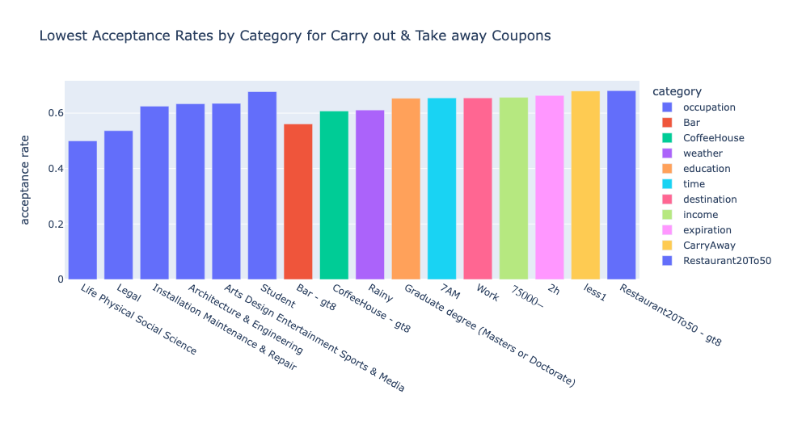

# assignment_5_1

This repo is my submission for Assignment 5.1 for UC Berkeley's [Professional Certificate in Machine Learning and Artificial Intelligence](https://em-executive.berkeley.edu/professional-certificate-machine-learning-artificial-intelligence) program.

Here is the link to the [Jupyter Notebook](assignment_5_1/prompt.ipynb) with the analysis for this dataset.

## The Assignment

We were given a dataset from the UCI Machine Learning repository that was collected via a survey on Amazon Mechanical Turk. The survey describes different driving scenarios including the destination, current time, weather, passenger, etc., as well as different driver characteristics, and asks if the person would accept the coupon presented ot them.

There were 5 different types of coupons:
- Bar
- Carry out & Take away
- Coffee House
- Restaurants(<20) - cheaper restaurants less than $20
- Restaurants(20-50) - restaurants from $20-50

The assignment was to produce a brief report highlighting the scenarios and characteristics of the drivers who accept the coupon for _one of the coupon types_. I chose the _Carry out & Take away_ coupon type because it had the highest acceptance rate compared to the other coupon types at 73%.

## The Findings

Here is a summary of the findings. More extensive visualizations are in the [Jupyter Notebook](assignment_5_1/prompt.ipynb).

### Highest Acceptance Rates
The highest acceptance rates come from 15 values across 5 categories:
- occupation (9 out of 15 values are specific occupations)
  - Building & Grounds Cleaning & Maintenance
  - Protective Service
  - Construction & Extraction
  - Healthcare Practitioners & Technical
  - Healthcare Support
  - Food Preparation & Serving Related
  - Business & Financial
  - Transportation & Material Moving
  - Farming Fishing & Forestry
- education = 'Some High School' and 'Associates degree'
- widows
- time of day = 2PM and 6PM (this makes sense that people would say no to a coupon while on the way to work in the morning)
- people who _never_ go to cheap restaurants (these seem to prefer to take away food to eat at home instead)

### Lowest Acceptance Rates

On the other hand, the lowest acceptance rates are much more spread out across categories.
The following scenarios and characteristics result in the lowest acceptance rates:
- occupation
  - Life Physical Social Science
  - Legal
  - Installation Maintenance & Repair
  - Architecture & Engineering
  - Arts Design Entertainment Sports & Media
  - Student
- Visit Frequencies
  - Bar - people who go to bars more than 8 times a month
  - Coffee House - people who go to Coffee House more than 8 times a month
  - Carry Away - people who carry away less than once a month (this tells us that they are not interested in Carry Away)
  - Restaurants - people who go to restaurants more than 8 times a month
- weather - rainy weather
- education = people with graduate degrees
- time of day = 7AM and destination = Work correspond with people who are going to work
- income level of $75000 - $87499 - which is the 3rd highest income level is 5% less likely than the next income level
- 2-hour expiration - shorter expiration (instead of 1-day) is not conducive to acceptance.

### 
